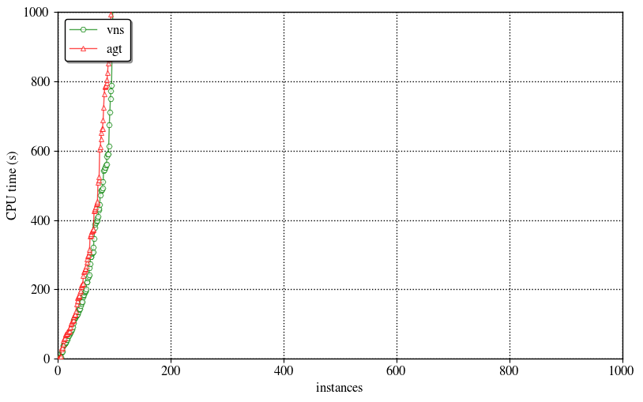
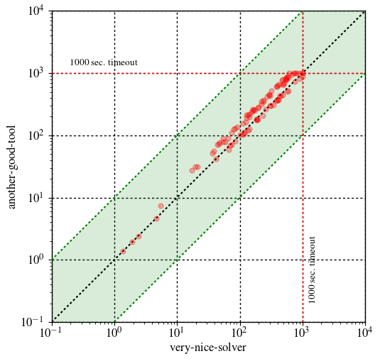

# Example usage
mkplot.py  --legend prog_alias -t 1000000 -b pdf --ylog --save-to datacenter_valleyfree.pdf  --xmax 280 --ymin 0.01 --ymax 1000 --lloc "lower right" solver*.json

where solver*.json are raw data files. This makes a CACTUS plot.

# mkplot

A Python script to create cactus and scatter plots based on the [matplotlib](http://matplotlib.org/) plotting library. The script makes use of only a tiny subset of what matplotlib can do.

mkplot was originally designed to make my life a lot easier by automating the plotting tasks, which a typical CS researcher has to deal with quite often. After a few years of using the script, I realized that it may be helpful for some other people (hopefully!) and so to make it publicly available. Enjoy! :)

## Getting Started

First of all, make sure you have a Python interpreter installed. To run the script, you also need to install the [matplotlib](http://matplotlib.org/) library. Please, see the corresponding [installation instructions](http://matplotlib.org/users/installing.html). Once matplotlib is installed on your computer, you can start using mkplot.

## Usage

The script has a number of parameters, which can be set from the command line. To see the list of options, run:

```
mkplot.py -h
```

### Input Format

The data to plot can be given in one of the two formats:

* [JSON](https://en.wikipedia.org/wiki/JSON)
* [CSV](https://en.wikipedia.org/wiki/Comma-separated_values)

While the CSV format is a simple table of values aggregating all the data, the preferred format is a series of JSON files, which describe the data for an individual tool/solver  following this example:

```json
{
	"preamble": {
		"program": "program-name",
		"prog_args": "-a some -b program --arguments",
		"prog_alias": "some-short-alias-to-use-in-the-plot",
		"benchmark": "name-of-benchmark-set"
	},
	"stats": {
		"some_problem_instance": {
			"status": true,
			"rtime": 10.567,
			"mempeak": "171864 KiB",
			"some-other-key": "key-value1"
		},
		"another_problem_instance": {
			"status": false,
			"rtime": 1000.00,
			"mempeak": "245759 KiB",
			"some-other-key": "key-value2"
		},
		"instance3": {
			"status": true,
			"rtime": 256.32,
			"mempeak": "57261 KiB",
			"some-other-key": "key-value3"
		}
	}
}
```

Here, the data describes the result of running a tool referred to as *"program-name"* with the given list of command-line arguments on a benchmark set called *"name-of-benchmark-set"* containing three problem instances. The result for each instance **must** have the information on its status: *true* or *false* meaning that the instance is solved or unsolved, respectively. All the other fields are non-mandatory (you can use whatever key/value you want). However, note that the *rtime* key is used by default when working with JSON files (to change this use the `-k` option).

For further details of the input format, please, see the [example files](examples).

### Using mkplot

A few usage examples of mkplot follow.

For instance, running

```
mkplot.py -l --legend prog_alias -t 1000 -b png --save-to examples/cactus.png examples/solver?.json
```

results in a simple cactus plot showing the performance of `very-nice-solver` and `another-good-tool`: 

Here, mkplot is set to show program aliases in the legend instead of their complete names.

If you need to create a scatter plot detailing the difference between the two solvers, just do

```
mkplot.py -l -p scatter -b png --save-to examples/scatter.png --shape squared -t 1000 --ylog --ymax 10000 --ymin 0.1 --xlog examples/csv-data.csv
```

The resulting scatter plot is the following:



Observe that here instead of JSON files, a CSV table is used.

## License

This project is licensed under the MIT License - see the [LICENSE](LICENSE) file for details.
